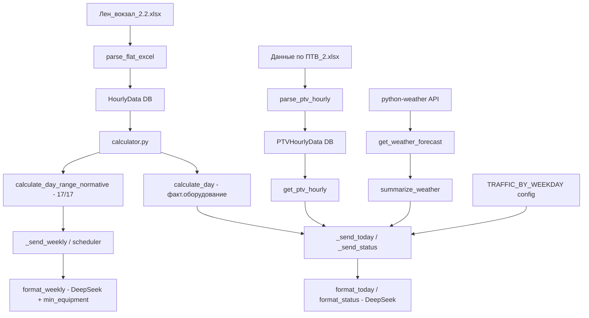

# План доработок v2.1: погода, пробки, переработка «Прогноза на неделю» и статуса

## Концептуальные изменения

### Два режима расчёта
| Кнопка | Оборудование | Логика |
|--------|-------------|--------|
| «Прогноз на сегодня» | **Фактическое** (из таблицы — `frames_working`, `turnstiles_working`) | Расчёт времени прохода как есть |
| «Текущий статус» | **Фактическое** (из таблицы) | Показ текущего часа + ПТВ за прошедший час |
| «Прогноз на неделю» | **Нормативное** (все 17 рамок, 17 турникетов) | Расчёт с полным оборудованием + рекомендации минимума |

### Формула минимального оборудования
Для каждого направления, для каждого часа:
```
min_equipment = ⌈ pass_per_train × PASS_SECONDS / 180 ⌉
```
Где:
- `TURNSTILE_PASS_SECONDS = 12` → `min_turnstiles = ⌈ pass_per_train × 12 / 180 ⌉`
- `FRAME_PASS_SECONDS = 40` → `min_frames = ⌈ pass_per_train × 40 / 180 ⌉`
- 180 = 3 минуты × 60 секунд (целевой порог зелёной зоны)

Для **периода** (группы часов) — берётся **максимум** требований по всем часам группы.

---

## Фаза 0: Архивирование
- Скопировать текущий код в `версии/2.0/`

## Фаза 1: config.py + requirements.txt

### config.py
- Добавить `STATION_LAT`, `STATION_LON` (координаты Ленинградского вокзала: 55.7766, 37.6553)
- Добавить `WEATHER_CITY` (из .env, по умолчанию "Moscow")
- Добавить `TRAFFIC_BY_WEEKDAY`:
  ```python
  TRAFFIC_BY_WEEKDAY = {0: 8, 1: 7, 2: 6, 3: 7, 4: 9, 5: 6, 6: 4}
  ```

### requirements.txt
- Добавить `python-weather>=2.0.0`
- Добавить `httpx` (уже используется в weather.py, но не в requirements)

## Фаза 2: models.py — новая таблица PTVHourlyData
- Новая модель `PTVHourlyData`:
  - `weekday` (SmallInteger, 1–7)
  - `hour` (SmallInteger, 0–23)
  - `station_name` (String)
  - `passengers` (Float)
- UPSERT по (`weekday`, `hour`, `station_name`)

## Фаза 3: load_excel.py — новые парсеры

### 3a. `parse_flat_excel` — поддержка колонки «дата»
- В `COLUMN_MAP` уже есть маппинг `"дата": "date"`, но нет в комментариях. Парсер уже умеет парсить `datetime`, `str`, и `pd.Timestamp` → проблем быть не должно.
- Убедиться, что файл `Лен_вокзал_2.2.xlsx` корректно парсится (первая колонка — строки дат "2026-05-18").

### 3b. Новый парсер `parse_ptv_hourly`
- Формат `Данные по ПТВ_2.xlsx`: [День недели, Час, Станция АСОП, Отправлено пассажиров по дням]
- Парсинг: день недели (1–7), час (0–23), название станции, пассажиры
- Маппинг названий станций как в существующем `parse_ptv_excel`

### 3c. `upsert_ptv_hourly`
- UPSERT по (weekday, hour, station_name)

### 3d. `guess_format` — определить новый PTV формат
- Ключевые слова для определения: `"станция асоп"`, `"отправлено пассажиров по дням"`
- Новый формат: `"ptv_hourly"`

### 3e. `load_all` — добавить обработку `ptv_hourly`

## Фаза 4: calculator.py — новый функционал

### 4a. `calculate_min_equipment(hours: list[HourResult]) -> dict`
- Для списка часов вычисляет:
  - `min_frames`: максимум ceil(pass_per_train × 40 / 180) по всем часам
  - `min_turnstiles`: максимум ceil(pass_per_train × 12 / 180) по всем часам
- Возвращает `{"min_frames": int, "min_turnstiles": int}`

### 4b. Обновить `_group_hours_by_zone`
- Вместо `avg_arriving_min` / `avg_departing_min` → хранить:
  - `min_arriving_min`, `max_arriving_min`
  - `min_departing_min`, `max_departing_min`
- Добавить поле `min_equipment` (результат `calculate_min_equipment` для группы)

### 4c. Новые функции для ПТВ
- `get_ptv_hourly(weekday: int, hour: int) -> list[dict]` — возвращает почасовые данные ПТВ для конкретного дня недели и часа

### 4d. Функция-обёртка для недельного прогноза
- `calculate_day_range_normative(start, end)` — вызывает `calculate_day_range` с `custom_frames=17, custom_turnstiles=17`

## Фаза 5: deepseek.py — обновление промптов и форматирования

### 5a. `_format_time_range` — исправить одиночный час
- Было: `start == end → "11:00"`
- Стало: `"11:00 – 12:00"` (всегда `end + 1` для конечной границы)

### 5b. `_group_hours_by_zone` — min/max вместо avg
- Уже описано в 4b

### 5c. `_build_grouped_input` — новый формат вывода
- Для не-зелёных зон:
  ```
  прибытие: время прохода от X мин до Y мин (высокая загрузка)
  ```
  вместо:
  ```
  прибытие: X.X мин (большое количество пассажиров)
  ```
- Замена причины: `"большое количество пассажиров"` → `"высокая загрузка"`
- Для недельного: добавлять строку `Минимально требуется: X рамок, Y турникетов`

### 5d. SYSTEM_TODAY — обновить промпт
- Добавить погоду и пробки в начало ответа
- Добавить количество оборудования
- Формат:
  ```
  <b>ожидаемый прогноз на сегодня (ДД.ММ)</b>
  
  🌤 Погода: ...
  🚗 Пробки: X баллов
  ⚙️ Рамок: X из 17, Турникетов: Y из 17
  
  ... диапазоны ...
  ```

### 5e. SYSTEM_WEEKLY — обновить промпт
- Добавить минимальное оборудование для загруженных периодов
- Формат диапазонов с «от X до Y мин»

### 5f. SYSTEM_STATUS — обновить промпт
- Секция ПТВ: `🚇 Пассажиропоток узла за прошедший час`
- Секция поездов: `👥 пассажиропоток дальнего следования`
- Цветные кружки у времени прохода (🔴🟡🟢 после времени)
- Статус: `высокая загрузка` / `средняя загрузка`
- Убрать «Статус: повышенный пассажиропоток» → заменить на «Статус: высокая загрузка»

### 5g. `format_weekly` — поддержка min_equipment в данных
- Передавать min_equipment в составе групп

### 5h. `format_today` — поддержка погоды/пробок/оборудования
- Новые параметры: weather_summary, traffic_ball, frames_working, turnstiles_working

## Фаза 6: weather.py — замена на python-weather
- Полная замена на библиотеку `python-weather`
- Асинхронный клиент, метрическая система
- Функция `get_weather_forecast()` → возвращает дневной прогноз
- Функция `summarize_weather()` → текст для вставки в сообщение
- Город брать из `config.WEATHER_CITY`

## Фаза 7: handlers.py — переработка всех 4 кнопок

### 7a. `_send_today` — погода + пробки + оборудование
- В начале: получить погоду через `get_weather_forecast()`
- Получить пробки: `TRAFFIC_BY_WEEKDAY[today.weekday()]`
- Показать фактическое количество оборудования (frames_working, turnstiles_working)
- Передать всё в `format_today`

### 7b. `_send_weekly` — нормативное оборудование + 6 дней вперёд
- Исключить сегодняшний день (start = tomorrow)
- 6 дней вперёд
- Если дата выходит за пределы имеющихся данных — использовать данные того же дня недели с ближайшей доступной даты, но отображать с **фактической будущей датой**
- Расчёт через `calculate_day_range_normative()` (17 рамок, 17 турникетов)
- Для загруженных периодов — показывать min_equipment
- Исправить `_format_time_range` (11:00 – 12:00)

### 7c. `_send_status` — переименования + почасовой ПТВ + кружки
- `Пассажиропоток станций (суточный)` → `Пассажиропоток узла за прошедший час`
- Данные: `get_ptv_hourly(today_weekday, current_hour - 1)`
- `Пассажиропоток на текущий час` → `пассажиропоток дальнего следования`
- Добавить цветные кружки (🔴🟡🟢) после времени прохода
- `Статус: повышенный пассажиропоток` → `Статус: высокая загрузка`
- `Статус: средний пассажиропоток` → `Статус: средняя загрузка`

### 7d. Fallback-функции — синхронизировать
- `_build_today_fallback` — добавить погоду/пробки/оборудование + min/max времена
- `_build_weekly_fallback` — норматив, 6 дней, min_equipment
- `_build_status_fallback` — переименования, кружки
- `_build_model_fallback` — min/max времена

## Фаза 8: scheduler.py — дайджест на неделю
- Использовать нормативное оборудование (17/17)
- 6 дней вперёд (исключая сегодня)
- Переиспользование данных для будущих дней с правильными датами
- Fallback с min_equipment

## Фаза 9: Перезагрузка данных
- Поместить `Лен_вокзал_2.2.xlsx` и `Данные по ПТВ_2.xlsx` в `data/`
- Выполнить: `python -m scripts.load_excel`

---

## Порядок реализации
```
Фаза 0 → Фаза 1 → Фаза 2 → Фаза 3 → Фаза 4 → Фаза 5 → Фаза 6 → Фаза 7 → Фаза 8 → Фаза 9
```

## Диаграмма потоков данных (Mermaid)



## Примеры вывода

### Прогноз на сегодня
```
📅 ожидаемый прогноз на сегодня (20.05)

🌤 Температура: 12–18°C; Погода: Переменная облачность
🚗 Пробки: 6 баллов
⚙️ Рамок: 14 из 17, Турникетов: 13 из 17

00:00 – 06:00 — 🟢 нормальная загрузка

07:00 – 08:00 — 🔴 загруженный период
  прибытие: время прохода от 4 мин до 7 мин (высокая загрузка)
  отправление: время прохода от 3 до 5 мин (высокая загрузка)

09:00 – 23:00 — 🟢 нормальная загрузка
```

### Прогноз на неделю (фрагмент)
```
📆 ожидаемые прогнозы на неделю

21.05 четверг
00:00 – 06:00 — 🟢 нормальная загрузка
07:00 – 08:00 — 🔴 загруженный период
  прибытие: время прохода от 4 мин до 6 мин (высокая загрузка)
  отправление: время прохода от 3 до 5 мин (высокая загрузка)
  Минимально требуется: 14 рамок, 12 турникетов
09:00 – 23:00 — 🟢 нормальная загрузка

22.05 пятница
...
```

### Текущий статус
```
📊 Текущий статус
Дата и время: 20.05.2026 11:12

⚙️ Оборудование
Рамки на вход: 14 из 17 (82%)
Турникеты на выход: 13 из 17 (76%)

👥 пассажиропоток дальнего следования
Отправление: 860 пасс., рамок 14, время прохода 22.1 мин 🔴
Прибытие: 450 пасс., турникетов 13, время прохода 11.5 мин 🔴

🚇 Пассажиропоток узла за прошедший час
Комсомольская Сокольническая: 3.4 тыс.
Комсомольская Кольцевая: 2.8 тыс.
Площадь трех вокзалов МЦД-2: 1.9 тыс.
Площадь трех вокзалов МЦД-4: 2.1 тыс.
Всего узел: 10.2 тыс.
Статус: высокая загрузка
```
