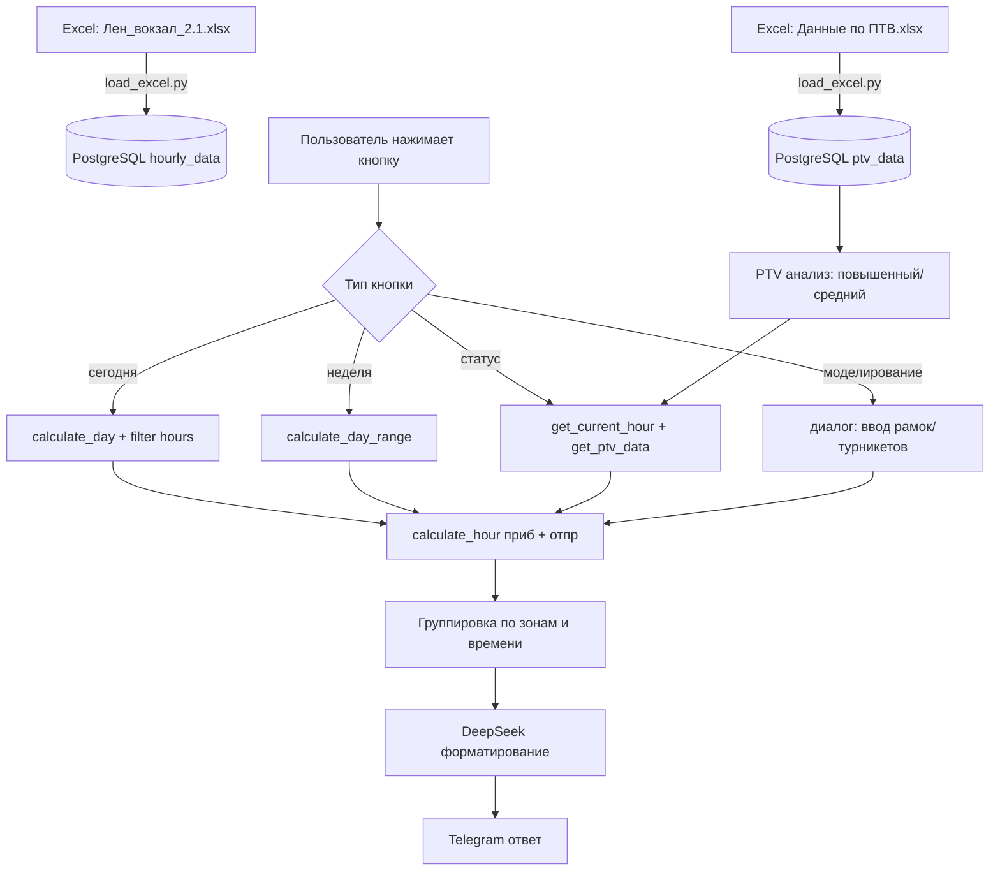

# План рефакторинга v2.0 — AIRailway

## Общая логика изменений

| Что было (v1.0) | Что будет (v2.0) |
|---|---|
| Только турникеты (60 сек) | Турникеты для прибывающих (12 сек) + Рамки для отправляющихся (40 сек) |
| Прибывающие пассажиры → турникеты | Два раздельных потока: прибытие (турникеты) + отправление (рамки) |
| Норматив + факт поездов (trains_arriving_norm / actual) | Только нормативные графики, `trains_actual` исключаем |
| `tourniquet_factor` для стресс-теста | Инструмент моделирования: пользователь вводит количество рамок и турникетов |
| 3 кнопки: дайджест / пики / стресс-тест | 4 кнопки: сегодня / неделя / статус / моделирование |
| Причины: окно/сбой, ремонт... | Только "большое количество пассажиров" + время прохода |
| Отображение по зонам (сначала красные, потом жёлтые) | Отображение по времени с группировкой соседних зон |
| Часы 1-24 | Часы 0-23 |
| `trains_arriving_norm`, `trains_arriving_actual` | Только нормативные: `trains_arriving`, `trains_departing` |

---

## Фаза 0: Сохранение текущей версии

### 0.1 Создать папку `версии/1.0/`
- Скопировать все `.py` файлы из `src/`, `scripts/`, корня
- Скопировать `README.md`, `requirements.txt`, `.env.example`, `setup.bat`
- Скопировать `plans/`
- **НЕ копировать** `.venv/`, `logs/`, `__pycache__/`, `data/`, `.env`

---

## Фаза 1: Новая модель данных и БД

### 1.1 Новая таблица `hourly_data_v2` (пересоздаём)
```python
class HourlyDataV2(Base):
    __tablename__ = "hourly_data"
    # date, hour: 0-23
    passengers_arriving: int      # прибывшие пассажиры (через турникеты)
    passengers_departing: int     # отправленные пассажиры (через рамки)
    trains_arriving: int          # прибывающие поезда (только норматив)
    trains_departing: int         # отправляющиеся поезда (только норматив)
    frames_working: int           # работающие рамки для отправляющихся
    turnstiles_working: int       # работающие турникеты для прибывающих
    source_file: str
```

### 1.2 Новая таблица `ptv_data`
```python
class PTVData(Base):
    __tablename__ = "ptv_data"
    date: date
    station_name: str
    passengers_per_day: float     # тыс. пасс./сутки
```

### 1.3 Дропнуть старые таблицы и создать новые
- `Base.metadata.drop_all` для `hourly_data`, затем `create_all`
- Или просто удалить старую БД и создать заново

---

## Фаза 2: Новый парсер Excel

### 2.1 Парсер для `Лен_вокзал_2.1.xlsx`
- Столбцы: `день недели | час | отправленные пассажиры | отправленные поезда | прибывшие пассажиры | прибывшие поезда | рамки для отправляющихся | турникеты для прибывающих`
- Часы: 0-23
- Пассажиры: округляем до целых (сейчас встречаются float: 792.0447...)
- UPSERT по (date, hour)

### 2.2 Парсер для `Данные по ПТВ.xlsx`
- Заголовки: `отправленные пассажиры | ДД.ММ.ГГГГ | ...`
- Строки: `комсомольская (сокольническая линия)`, `комсомольская (кольцевая линия)`, `Площадь трех вокзалов МЦД-2`, `Площадь трех вокзалов МЦД-4`
- Значения в тыс. пасс./сутки
- UPSERT по (date, station_name)

### 2.3 Загрузка данных
- Запустить `python -m scripts.load_excel` для обоих файлов
- Данные в БД должны быть полными после загрузки

---

## Фаза 3: Конфигурация

### 3.1 Новые параметры в `config.py`
```python
TURNSTILE_PASS_SECONDS = 12       # время прохода через турникет (прибывающие)
FRAME_PASS_SECONDS = 40           # время прохода через рамку (отправляющиеся)
ZONE_GREEN_MAX = 3                # до 3 мин — 🟢
ZONE_YELLOW_MAX = 5               # 3-5 мин — 🟡, >5 — 🔴
FRAMES_TOTAL = 17                 # всего рамок
TURNSTILES_TOTAL = 17             # всего турникетов
```
- Убрать `STRESS_TEST_FACTOR` (больше не нужен)
- Убрать `DAILY_DIGEST_HOUR/MINUTE` (если не используется)

---

## Фаза 4: Переписывание калькулятора

### 4.1 Новый `HourResult`
```python
class HourResult:
    # Общие поля
    date, hour
    
    # Прибытие (турникеты)
    passengers_arriving: int
    trains_arriving: int
    turnstiles_working: int
    arriving_pass_per_train: float
    arriving_total_seconds: float
    arriving_total_minutes: float
    arriving_zone: str           # green/yellow/red
    
    # Отправление (рамки)
    passengers_departing: int
    trains_departing: int
    frames_working: int
    departing_pass_per_train: float
    departing_total_seconds: float
    departing_total_minutes: float
    departing_zone: str          # green/yellow/red
    
    # Причины
    reasons_arriving: list[str]
    reasons_departing: list[str]
```

### 4.2 Функция `calculate_hour()` — новая версия
```
Для прибытия:
  Если trains_arriving > 0 и passengers_arriving > 0:
    pass_per_train = passengers_arriving / trains_arriving
    time_one = pass_per_train * 12 сек
    total_sec = time_one / turnstiles_working
    total_min = total_sec / 60
    Зона: < 3 мин 🟢, 3-5 🟡, ≥ 5 🔴
    Если pass_per_train > 500 → причина "большое количество пассажиров"

Для отправления (аналогично, но 40 сек и frames_working):
    pass_per_train = passengers_departing / trains_departing
    time_one = pass_per_train * 40 сек
    total_sec = time_one / frames_working
    ...
```

### 4.3 Убрать из калькулятора
- `trains_arriving_actual` — полностью
- `trains_shortfall` — не нужно
- `turnstile_factor` — заменён на прямое указание количества
- Причины `окно/сбой в графике` и `ремонт турникетов`
- Функцию `calculate_today_stress_test` (уже удалена)

### 4.4 Новые вспомогательные функции
- `calculate_day_with_params(date, frames, turnstiles)` — для инструмента моделирования
- `get_ptv_data(date)` — получение данных ПТВ за конкретную дату
- `get_ptv_weekly()` — получение всех данных ПТВ для сравнения

---

## Фаза 5: Форматирование вывода (DeepSeek)

### 5.1 Новый формат отображения — группировка по времени
```
<b>ожидаемый прогноз на сегодня (ДД.ММ)</b>

00:00 – 07:00 — 🟢 зеленая зона без проблем

07:00 – 08:00 — 🔴 красная зона
  прибытие: время прохода 5.2 мин (большое количество пассажиров)
  отправление: время прохода 3.8 мин

08:00 – 09:00 — 🟡 желтая зона
  прибытие: время прохода 3.4 мин

09:00 – 18:00 — 🟢 зеленая зона
...
```

### 5.2 Правила группировки
- Идём по часам последовательно (0→23)
- Группируем соседние часы с одинаковой итоговой зоной
- Итоговая зона — худшая из двух (если прибытие/отправление различаются)
- Время прохода — среднее по диапазону (если >1 часа)
- Причина только если `pass_per_train > 500` → "большое количество пассажиров"

### 5.3 Новые системные промпты для DeepSeek
- `SYSTEM_TODAY` — для прогноза на сегодня
- `SYSTEM_WEEKLY` — для прогноза на неделю
- `SYSTEM_STATUS` — для текущего статуса
- `SYSTEM_MODEL` — для инструмента моделирования
- Убрать: `SYSTEM_DIGEST`, `SYSTEM_PEAKS`, `SYSTEM_STRESS`

---

## Фаза 6: Обработчики кнопок

### 6.1 Новое главное меню
```python
def main_menu_keyboard():
    return [
        [Button("📅 Прогноз на сегодня", callback="today")],
        [Button("📆 Прогноз на неделю", callback="weekly")],
        [Button("📊 Текущий статус", callback="status")],
        [Button("🔧 Моделирование", callback="model")],
    ]
```

### 6.2 Кнопка 1: «Прогноз на сегодня»
- `today = date.today()` → найти в БД дату с тем же днём недели
- Только часы >= текущего часа
- Заголовок: `ожидаемый прогноз на сегодня (ДД.ММ)`
- Группировка по зонам, время прохода для каждого потока

### 6.3 Кнопка 2: «Прогноз на неделю»
- 7 дней вперёд (или доступные)
- Заголовок: `ожидаемые прогнозы на неделю`
- Для каждого дня: группировка по зонам

### 6.4 Кнопка 3: «Текущий статус»
- Текущие дата/время
- Количество рамок и турникетов (из БД на текущий час)
- % работающих от общих (17)
- Пассажиропоток отправления (зона + время прохода) на текущий час
- Пассажиропоток прибытия (зона + время прохода) на текущий час
- **Ниже**: пассажиропоток станций (суточный) из ПТВ:
  - Комсомольская (сокольническая) — xx тыс.
  - Комсомольская (кольцевая) — xx тыс.
  - Площадь трех вокзалов МЦД-2 — xx тыс.
  - Площадь трех вокзалов МЦД-4 — xx тыс.
  - Всего узел (сумма)
  - Статус: "повышенный пассажиропоток" / "средний пассажиропоток"
    - (сравнение: топ-2 дня из доступных = повышенный, остальные = средний)

### 6.5 Кнопка 4: «Моделирование»
- **Шаг 1**: Бот спрашивает "введите количество работающих рамок на вход (всего 17)"
- **Шаг 2**: Пользователь вводит число → бот спрашивает "введите количество работающих турникетов на выход (всего 17)"
- **Шаг 3**: Пользователь вводит число → расчёт на все оставшиеся часы дня
- Вывод:
```
моделирование ситуации на хх час:
количество отправлений — хх, рамок на вход — хх, время прохода — хх
количество прибывающих пассажиров — хх, турникетов на выход — хх, время прохода — хх
```
- Плюс группировка по зонам для оставшихся часов

---

## Фаза 7: Логирование расчётов

### 7.1 Включить `logger.info` в `calculate_hour()` для каждого потока
```
logger.info("🟢 ПРИБЫТИЕ [%s %02d:00] пасс=%d поезда=%d рамок=%d → %.1f мин",
            date, hour, passengers_arriving, trains_arriving, frames_working, minutes)
logger.info("🟢 ОТПРАВЛЕНИЕ [%s %02d:00] пасс=%d поезда=%d турникетов=%d → %.1f мин",
            date, hour, passengers_departing, trains_departing, turnstiles_working, minutes)
```

---

## Фаза 8: Обновление планировщика

### 8.1 `send_weekly_digest()` → адаптировать под новый формат
- Использовать `format_weekly()` вместо `format_digest()`
- Убрать `send_daily_digest()` если есть

---

## Фаза 9: Погода и пробки (отложено)

### 9.1 План исследования (НЕ реализовывать сейчас)
- Погода: `python-weather` или `openweathermap` API → дневная температура/осадки
- Пробки: парсинг Яндекс.Пробки или данные из вашей таблицы
- Вывод в кнопках 1, 2, 3 как справочная информация (не влияет на расчёты)

---

## Диаграмма потоков данных



---

## Порядок реализации (критический путь)

1. Фаза 0 — сохранить текущую версию в `версии/1.0/`
2. Фаза 1 — новая модель БД (дроп + recreate)
3. Фаза 2 — новые парсеры Excel
4. Фаза 3 — config.py с новыми параметрами
5. Фаза 4 — calculator.py (полная переработка)
6. Фаза 5 — deepseek.py (новые промпты)
7. Фаза 6 — handlers.py (4 кнопки + диалог моделирования)
8. Фаза 7 — логирование
9. Фаза 8 — scheduler адаптация
10. Фаза 9 — исследование погоды/пробок (отдельно)
